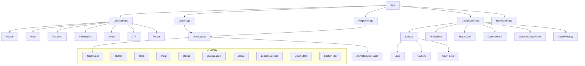
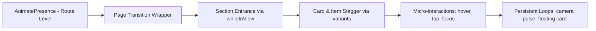
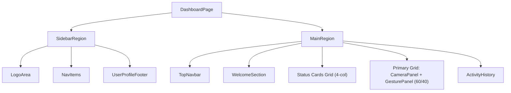
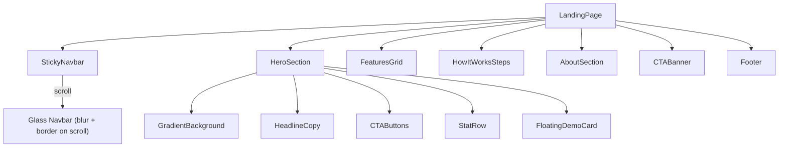
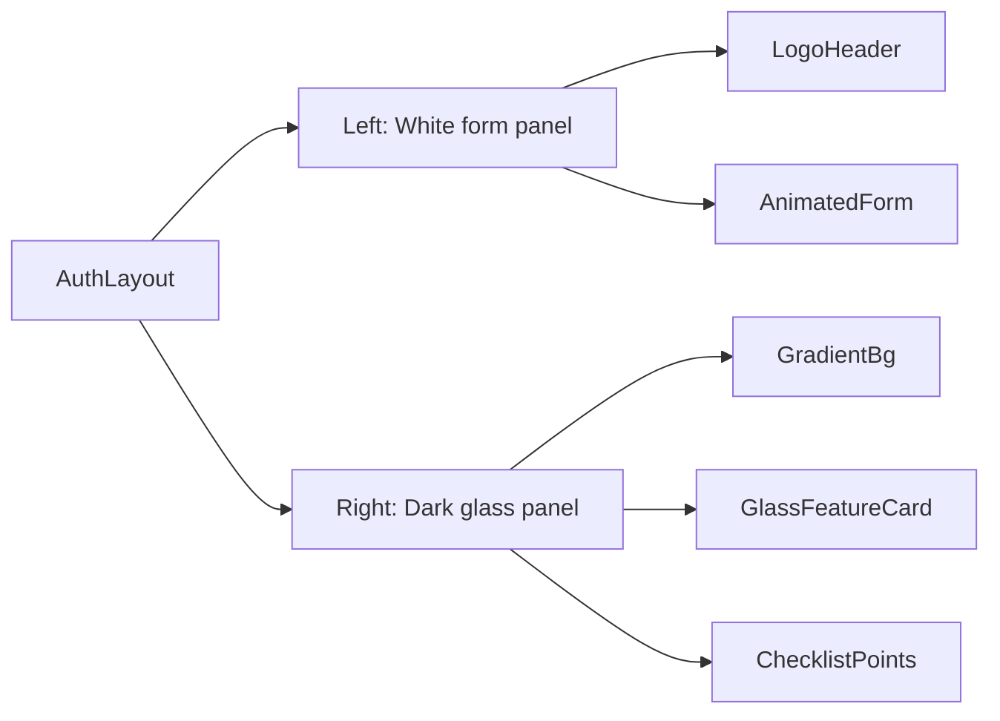
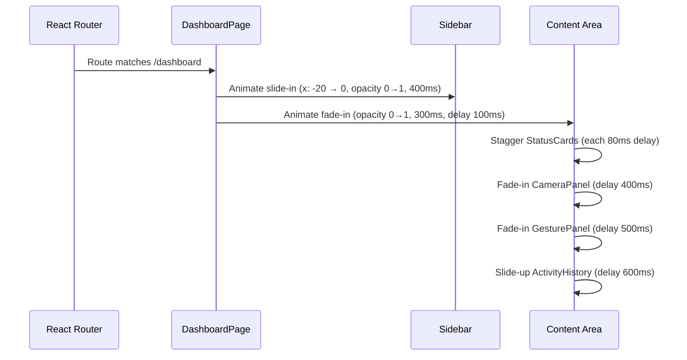
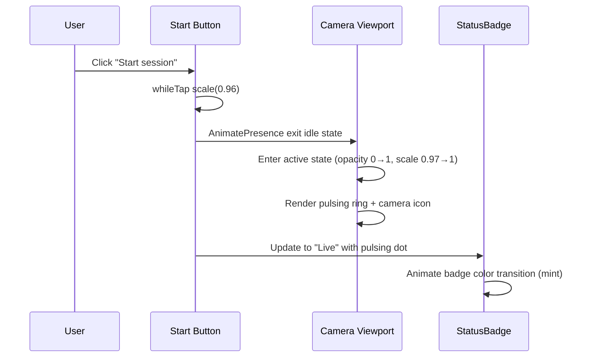
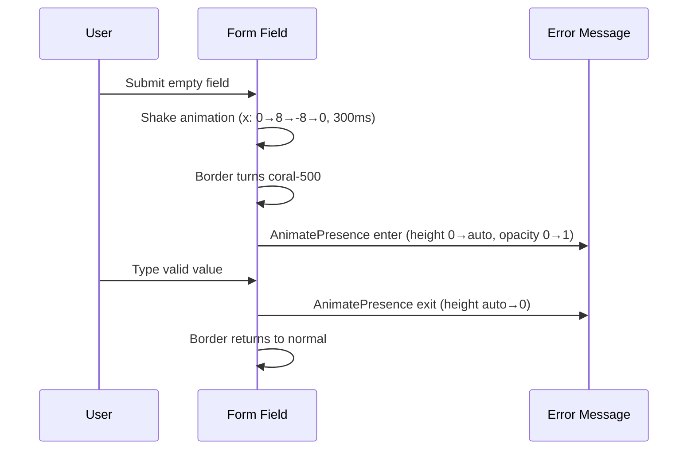

# Design Document: SignSync Frontend Redesign

## Overview

SignSync's frontend will be elevated from a functional prototype to a polished, hackathon-winning application by applying glassmorphism, Framer Motion animations throughout, modern typography and spacing, a cohesive design token system, and a fully responsive layout. All existing routes and business logic remain untouched — only visual layer and interaction quality improve.

The redesign targets three surface areas in priority order: **Dashboard** (primary working surface), **Landing page** (first impression), and **Auth pages** (onboarding experience). A consolidated `src/components/ui/` library is the foundation — every page consumes shared primitives so visual changes propagate uniformly.

---

## Architecture

### Page & Component Hierarchy



### Animation Layer Architecture



---

## Design Token System

### Color Palette (extends existing Tailwind config)

| Token | Hex | Usage |
|---|---|---|
| `signal-500` | `#2563EB` | Primary actions, links, active states |
| `signal-600` | `#1B4FCB` | Hover/pressed primary |
| `mint-400` | `#4CD9B0` | Success, live/active indicators |
| `coral-500` | `#FB6F58` | Errors, destructive actions |
| `ink-900` | `#0B1220` | Primary text |
| `ink-500` | `#526080` | Secondary text |
| `paper` | `#F7F9FC` | Page background |
| `white` | `#FFFFFF` | Card surfaces |

**New tokens to add to `tailwind.config.js`:**

| Token | Value | Usage |
|---|---|---|
| `glass` | `rgba(255,255,255,0.08)` | Glassmorphism fill |
| `glass-border` | `rgba(255,255,255,0.15)` | Glassmorphism border |
| `shadow-glass` | `0 8px 32px rgba(15,32,84,0.18), inset 0 1px 0 rgba(255,255,255,0.12)` | Glass card shadow |
| `shadow-elevated` | `0 4px 6px -1px rgba(15,32,84,0.1), 0 20px 48px -8px rgba(15,32,84,0.18)` | Elevated cards |
| `shadow-glow-mint` | `0 0 24px rgba(76,217,176,0.35)` | Active camera indicator |
| `shadow-glow-signal` | `0 0 20px rgba(37,99,235,0.25)` | Primary button glow |

### Typography Scale

| Element | Font | Weight | Size |
|---|---|---|---|
| Hero H1 | Sora (display) | 800 | `text-5xl` → `text-7xl` |
| Section H2 | Sora (display) | 700 | `text-3xl` → `text-5xl` |
| Card H3 | Sora (display) | 600 | `text-xl` |
| Stat numbers | Sora (display) | 800 | `text-3xl` → `text-4xl` |
| Body | Inter | 400 | `text-base` |
| Labels/captions | Inter | 600 | `text-sm` |

### Spacing & Radius

| Token | Value | Usage |
|---|---|---|
| `rounded-2xl` | `1rem` | Cards, inputs |
| `rounded-3xl` | `1.5rem` (new `xl3`) | Hero card, modals, CTA block |
| `rounded-full` | Full radius | Badges, avatars, pills |
| Section padding | `py-28 sm:py-32` | Generous breathing room |
| Card padding | `p-6 sm:p-8` | Standard card inner |
| Dashboard gap | `gap-6` | Consistent grid gaps |

---

## Component Architecture

### UI Primitives (`src/components/ui/`)

#### `Button` — Enhanced

Adds `whileTap`, `whileHover` Framer Motion wrapping. New `icon` variant for icon-only circular buttons. Glow effect option on primary variant.

```typescript
interface ButtonProps extends ButtonHTMLAttributes<HTMLButtonElement> {
  variant?: 'primary' | 'secondary' | 'ghost' | 'outline' | 'icon'
  size?: 'sm' | 'md' | 'lg'
  isLoading?: boolean
  fullWidth?: boolean
  glow?: boolean          // adds drop-shadow glow on primary
  leftIcon?: ReactNode
  rightIcon?: ReactNode
}
```

#### `Card` — Enhanced

Adds `glass` variant for glassmorphism cards, `elevated` variant, and `interactive` for hover lift with shadow transition.

```typescript
interface CardProps extends HTMLAttributes<HTMLDivElement> {
  variant?: 'default' | 'glass' | 'elevated' | 'outlined'
  padded?: boolean
  interactive?: boolean   // hover lift + shadow on whileHover
  as?: 'div' | 'article' | 'section'
}
```

#### `GlassCard` — New

Dedicated glassmorphism card used on auth side panel and hero feature preview.

```typescript
interface GlassCardProps extends HTMLAttributes<HTMLDivElement> {
  blur?: 'sm' | 'md' | 'lg'    // backdrop-blur intensity
  border?: boolean               // subtle white border
  padding?: 'sm' | 'md' | 'lg'
}
```

#### `Input` — Enhanced

Floating label animation, focus ring with glow, animated error shake via Framer Motion.

```typescript
interface InputProps extends InputHTMLAttributes<HTMLInputElement> {
  label: string
  error?: string
  hint?: string
  icon?: ReactNode
  trailingAction?: ReactNode
  floatingLabel?: boolean     // label floats up on focus/value
}
```

#### `Badge` / `StatusBadge` — Enhanced

`StatusBadge` is a new variant with a pulsing dot for live statuses (active, idle, error).

```typescript
interface StatusBadgeProps {
  status: 'live' | 'idle' | 'error' | 'warning'
  label: string
  pulse?: boolean
}
```

#### `LoadingSpinner` — New

```typescript
interface LoadingSpinnerProps {
  size?: 'sm' | 'md' | 'lg'
  color?: 'primary' | 'white' | 'muted'
  label?: string    // accessible aria-label
}
```

#### `EmptyState` — New

```typescript
interface EmptyStateProps {
  icon?: ReactNode
  title: string
  description?: string
  action?: ReactNode
}
```

#### `SectionTitle` — New

Reusable section header with badge, heading, and optional subtext — prevents duplication across landing sections.

```typescript
interface SectionTitleProps {
  badge?: string
  badgeTone?: BadgeTone
  heading: string
  subtext?: string
  align?: 'left' | 'center'
}
```

#### `Modal` — New

Accessible modal using `AnimatePresence` for enter/exit, focus trap, backdrop blur.

```typescript
interface ModalProps {
  isOpen: boolean
  onClose: () => void
  title?: string
  size?: 'sm' | 'md' | 'lg'
  children: ReactNode
}
```

---

## Layout Architecture

### Dashboard Layout



**Sidebar redesign:**
- Dark sidebar: `bg-ink-900` with subtle gradient
- Active item: bright `signal-400` left border + `bg-white/5` fill
- Collapsed state on mobile: slide animation via `x: -288` → `x: 0`
- User profile chip pinned to bottom with avatar initials + name + logout

**TopNavbar redesign:**
- Glass effect: `bg-white/70 backdrop-blur-xl`
- Greeting text with gradient accent on username
- Search bar with animated expand on focus
- Notification bell with animated badge count
- User avatar with dropdown menu (Framer Motion scale+opacity)

### Landing Layout



### Auth Layout



---

## Sequence Diagrams

### Dashboard Page Load Animation



### Camera Session Toggle



### Form Validation Animation



---

## Animation Configuration (Framer Motion)

### Page Transition Variants

```typescript
// Applied at route level in App.tsx via AnimatePresence
const pageVariants = {
  initial: { opacity: 0, y: 12 },
  animate: { opacity: 1, y: 0, transition: { duration: 0.35, ease: [0.4, 0, 0.2, 1] } },
  exit:    { opacity: 0, y: -8,  transition: { duration: 0.2 } }
}
```

### Stagger Container Variants

```typescript
// Parent container that staggers children
const containerVariants = {
  hidden: {},
  visible: {
    transition: { staggerChildren: 0.08, delayChildren: 0.1 }
  }
}

const itemVariants = {
  hidden: { opacity: 0, y: 16 },
  visible: { opacity: 1, y: 0, transition: { duration: 0.45, ease: 'easeOut' } }
}
```

### Card Hover Variants

```typescript
const cardHoverVariants = {
  rest:  { y: 0, boxShadow: '0 1px 2px rgba(15,32,84,0.04), 0 8px 24px rgba(15,32,84,0.06)' },
  hover: { y: -4, boxShadow: '0 4px 6px rgba(15,32,84,0.1), 0 20px 48px rgba(15,32,84,0.18)',
           transition: { duration: 0.25, ease: 'easeOut' } }
}
```

### Sidebar Drawer Variants (mobile)

```typescript
const drawerVariants = {
  closed: { x: '-100%', transition: { type: 'tween', duration: 0.28, ease: [0.4, 0, 1, 1] } },
  open:   { x: 0,       transition: { type: 'tween', duration: 0.32, ease: [0, 0, 0.2, 1] } }
}

const backdropVariants = {
  hidden:  { opacity: 0 },
  visible: { opacity: 1, transition: { duration: 0.22 } }
}
```

### Error Shake

```typescript
const shakeVariants = {
  idle:  { x: 0 },
  shake: {
    x: [0, 8, -8, 6, -6, 3, -3, 0],
    transition: { duration: 0.5, ease: 'easeInOut' }
  }
}
```

### Button Interaction

```typescript
// Added to all Button variants via motion.button
const buttonMotion = {
  whileHover: { scale: 1.02 },
  whileTap:   { scale: 0.97 },
  transition: { type: 'spring', stiffness: 400, damping: 25 }
}
```

---

## Responsive Breakpoints

```typescript
// Tailwind breakpoints used throughout
const breakpoints = {
  sm:  '640px',   // Single-col → Two-col status grid
  md:  '768px',   // Auth layout gains side panel
  lg:  '1024px',  // Sidebar shows persistently; hero becomes 2-col
  xl:  '1280px',  // 4-col status grid; wider content max-width
  '2xl': '1536px' // Optional ultra-wide capping
}
```

**Responsive patterns:**
- Status cards: `grid-cols-1 sm:grid-cols-2 xl:grid-cols-4`
- Dashboard primary grid: `grid-cols-1 xl:grid-cols-[1.6fr_1fr]`
- Features grid: `grid-cols-1 sm:grid-cols-2 lg:grid-cols-3`
- HowItWorks: `grid-cols-1 sm:grid-cols-2 lg:grid-cols-4`
- Sidebar: persistent `w-72` on `lg+`, drawer on smaller screens

---

## Key Component Interface Specifications

### `Sidebar` Props

```typescript
interface SidebarProps {
  isOpen: boolean
  onClose: () => void
  // Sidebar renders dark bg-ink-900 instead of white
  // Active item highlighted with signal-400 accent bar + bg-white/5
  // Framer Motion: AnimatePresence for mobile drawer, stagger nav items on open
}
```

### `TopNavbar` Props

```typescript
interface TopNavbarProps {
  onMenuClick: () => void
  // Glassmorphism: bg-ink-900/60 backdrop-blur-xl border-b border-white/5
  // User avatar opens dropdown via AnimatePresence scale+opacity
  // Search expands width via layout animation on focus
}
```

### `StatusCard` Props

```typescript
interface StatusCardProps {
  metric: StatusMetric
  // Animated number count-up on mount using framer-motion useMotionValue
  // Gradient icon container (signal-500 to signal-700)
  // Hover: interactive card lift
}
```

### `CameraPanel` Props

```typescript
interface CameraPanelProps {
  // No prop changes — purely visual & animation upgrade
  // Idle state: subtle gradient with centered camera icon + animated ring
  // Active state: pulsing mint ring, scanning line animation, grid overlay
  // StatusBadge replaces raw Badge for live/idle indicator
  // Start/Stop button uses whileTap micro-interaction
}
```

### `GestureOutputPanel` Props

```typescript
interface GestureOutputPanelProps {
  // No prop changes
  // Each gesture entry: stagger entrance, slide from right
  // Confidence bar visual instead of plain percentage badge
  // Empty state component when no gestures yet
}
```

### `ActivityHistory` Props

```typescript
interface ActivityHistoryProps {
  // No prop changes
  // Timeline visual: vertical line with icon nodes
  // Each entry: slide-up on whileInView
  // Accuracy: ring/arc progress indicator instead of plain badge
}
```

---

## Section-Level Design Details

### Hero Section

- **Background:** Deep gradient `from-ink-900 via-signal-900 to-ink-900` with mesh gradient overlays
- **Headline:** Larger `text-6xl lg:text-7xl`, tighter leading, white
- **Sub-headline:** `text-signal-100/80`, `max-w-lg`
- **CTA buttons:** Primary = white bg + signal text with glow on hover; Secondary = outline with glass fill
- **Stat row:** Three stats separated by vertical dividers, count-up animation on mount
- **Demo card:** Glassmorphism card floating right with `animate-floaty`, hand landmark SVG, caption pills
- **Particle/orb accents:** Two large blurred radial gradients + grid pattern overlay for depth

### Features Section

- **Background:** `bg-paper` → enhanced to `bg-gradient-to-b from-white to-paper`
- **Section title:** `SectionTitle` component centered
- **Cards:** `Card variant="elevated"` with gradient icon containers (each feature gets unique gradient)
- **Hover:** `interactive` card prop, icon container scales up slightly
- **Stagger:** Cards animate in `whileInView` with 80ms stagger

### HowItWorks Section

- **Background:** `bg-white`
- **Step numbers:** Gradient filled circles (`from-signal-500 to-signal-600`) with glow shadow
- **Connector line:** Dashed line between steps on desktop with animated `strokeDashoffset` draw
- **Step cards:** Glass-tinted cards on hover

### About Section

- **Layout:** Two-column on `lg+`, staggered entrance
- **Stats cards:** Larger numbers with gradient text
- **Community card:** Spans two columns with subtle border

### CTA Section

- **Block:** Deeper gradient (`from-signal-700 via-signal-800 to-ink-900`), mesh overlay
- **Noise texture:** Optional SVG filter for premium feel
- **Headline:** Larger font, `text-balance`

### Auth Pages

- **Left panel:** White, generous padding, subtle gradient background `from-white to-paper`
- **Right panel:** Dark glass with `backdrop-blur`, radial gradient overlays, checkmark list
- **Form fields:** Floating label animation, focus glow ring, error shake animation
- **Password strength:** Animated bar segments with color transitions

### Dashboard Sidebar

- **Base:** `bg-ink-900` (dark) with thin right border `border-white/5`
- **Logo area:** Logo with white text on dark background
- **Nav items:** Icon + label, active = `bg-white/8 text-white` with `border-l-2 border-signal-400`
- **Hover:** `bg-white/5` fill transition
- **User footer:** Avatar chip with name, email truncated, logout icon button
- **Mobile:** Full-height drawer with `AnimatePresence` + backdrop

### Dashboard TopNavbar

- **Base:** `bg-ink-900/70 backdrop-blur-xl border-b border-white/5`
- **Greeting:** "Good morning, [Name]" with time-aware message
- **Search:** Glass-style input, expands on focus via `layoutId` animation
- **Notification:** Bell with animated red dot, dropdown on click
- **Avatar:** Gradient initials circle, opens user menu dropdown

---

## Components and Interfaces

See [Component Architecture](#component-architecture) above for full TypeScript interface definitions of every UI primitive and dashboard component.

Key component contracts:
- `Button` — `variant`, `size`, `isLoading`, `fullWidth`, `glow` props; wraps `motion.button` for tap/hover micro-interactions
- `Card` — `variant` (`default` | `glass` | `elevated` | `outlined`), `padded`, `interactive` props
- `GlassCard` — `blur`, `border`, `padding` props; used on auth panel and hero demo card
- `Input` — `label`, `error`, `hint`, `icon`, `trailingAction`, `floatingLabel` props; Framer Motion error shake
- `StatusBadge` — `status` (`live` | `idle` | `error` | `warning`), `label`, `pulse` props
- `Modal` — `isOpen`, `onClose`, `title`, `size` props; `AnimatePresence` enter/exit, focus trap
- `LoadingSpinner` — `size`, `color`, `label` props
- `EmptyState` — `icon`, `title`, `description`, `action` props
- `SectionTitle` — `badge`, `badgeTone`, `heading`, `subtext`, `align` props

## Data Models

No new data models are introduced. The redesign consumes existing types from `src/types/index.ts` without modification:

```typescript
// Existing models consumed by redesigned components (no changes)
interface StatusMetric {
  id: string;
  label: string;
  value: string;
  helper: string;
  icon: 'activity' | 'clock' | 'target' | 'zap';
  trend?: string;
  trendDirection?: 'up' | 'down';
}

interface RecognizedGesture {
  id: string;
  word: string;
  confidence: number;  // 0-100; drives confidence bar fill width
  timestamp: string;
}

interface ActivityEntry {
  id: string;
  title: string;
  detail: string;
  duration: string;
  timestamp: string;
  accuracy: number;   // 0-100; drives arc progress indicator
  type: 'conversation' | 'practice' | 'translation';
}
```

**Animation state models (component-local, not persisted):**

```typescript
// Local to CameraPanel
type SessionStatus = 'idle' | 'listening' | 'translating'

// Local to Sidebar (mobile only)
type SidebarState = { isOpen: boolean; activeHref: string }

// Local to TopNavbar
type NavbarState = { searchExpanded: boolean; notificationsOpen: boolean }
```

## Error Handling

### Animation Errors
- If Framer Motion fails to resolve a variant key, components fall back to CSS-only transitions via the `transition-all duration-200` Tailwind class already on all interactive elements
- `AnimatePresence` children must always have `key` props; missing keys cause silent no-animation fallback (acceptable)

### Reduced Motion
- The existing `@media (prefers-reduced-motion: reduce)` rule in `index.css` sets all animation durations to `0.01ms`, effectively disabling Framer Motion animations for users who opt out
- All layout/functional content must be fully accessible without animations

### Component Boundary Errors
- Auth pages: form submission errors display via `formError` state string, styled with `text-coral-600`; the animated shake only fires on validation fail, not network errors
- Camera panel: toggle errors are silent (no backend in this scope); the button simply reverts state

## Correctness Properties

### Property 1: Variant Exhaustiveness
For every component with a `variant` prop, all declared variant values must map to a non-empty Tailwind class string, and no undefined variant passed at runtime may cause a render exception.

### Property 2: Animation Completeness
Every `motion.*` element must define both `initial` and `animate` props so no component renders in an intermediate state on first paint.

### Property 3: AnimatePresence Key Uniqueness
All direct children of `AnimatePresence` wrappers must carry unique `key` props; duplicate keys cause incorrect exit animations.

### Property 4: Keyboard Accessibility Preservation
All Framer Motion wrappers applied to interactive elements must forward `onKeyDown`, `aria-*`, and `tabIndex` from the underlying HTML element unchanged.

### Property 5: Responsive Overflow Safety
No grid or flex layout may produce horizontal scroll on any viewport from 320px to 1536px wide, verified across all five pages.

### Property 6: Contrast Compliance
Glassmorphism card text must maintain ≥ 3:1 contrast ratio against glass fill background for large text (WCAG AA), and ≥ 4.5:1 for body text.

### Property 7: Focus Trap Correctness
The Modal and mobile Sidebar drawer must trap keyboard focus within their boundaries while open and restore focus to the triggering element on close.

### Property 8: Route Preservation
`AnimatePresence` wrapping `Routes` in `App.tsx` must not alter which component is rendered for any route path; only opacity/transform transitions are added.

### Property 9: Reduced-Motion Compliance
All `keyframes` and Framer Motion `transition.duration` values must resolve to effectively zero under `prefers-reduced-motion: reduce`.

### Property 10: whileInView Idempotency
All scroll-triggered animations must use `viewport={{ once: true }}` so re-scrolling does not re-trigger entrance animations.

---

## Testing Strategy

### Unit Testing Approach

Test each UI primitive in isolation:
- `Button`: renders all variants, shows spinner when `isLoading`, disabled state prevents click
- `Card`: applies correct classes per variant, children render
- `Input`: shows error message, floating label transitions, `aria-invalid` set on error
- `Badge` / `StatusBadge`: correct color class per tone/status
- `Modal`: focus trap on open, closes on Escape, backdrop click closes

### Property-Based Testing Approach

**Library:** fast-check

- For any `variant` string not in the allowed set passed to `Button` or `Card`, the component must not throw — it falls back to default variant
- For any `StatusMetric.value` string of length 1–20, `StatusCard` renders without overflow or layout break
- For any `ActivityEntry` with `accuracy` in [0, 100], the accuracy display stays within card bounds

### Integration Testing Approach

- Dashboard page mounts with mocked auth context, all four `StatusCard` components render with correct `metric` data
- Login form submits, calls `login()`, and navigates to `/dashboard` on success
- Camera panel toggles between idle and listening states, `StatusBadge` reflects the correct state

---

## Dependencies

All dependencies already present in `package.json`:

| Package | Version | Usage |
|---|---|---|
| `framer-motion` | `^11.2.10` | All animations, layout, transitions |
| `lucide-react` | `^0.400.0` | Icons throughout |
| `react-router-dom` | `^6.24.0` | Routing + `AnimatePresence` integration |
| `tailwindcss` | `^3.4.4` | Utility-first styling |

**No new dependencies required.** Glassmorphism, gradients, and all visual effects are achievable with Tailwind utilities + Framer Motion + CSS custom properties.
